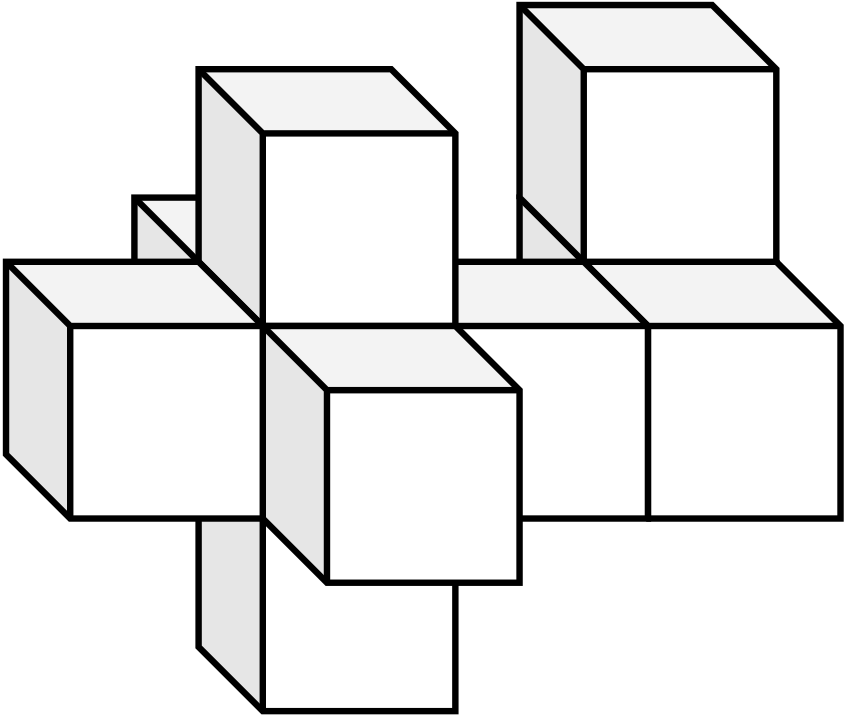
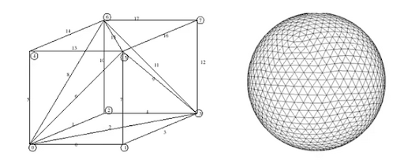
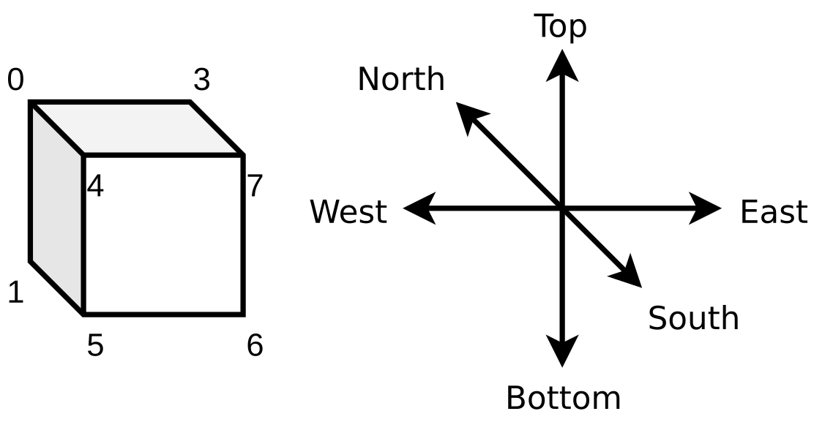
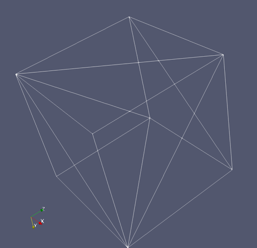
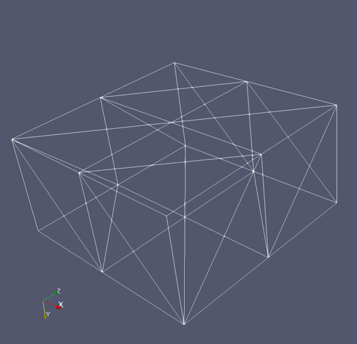
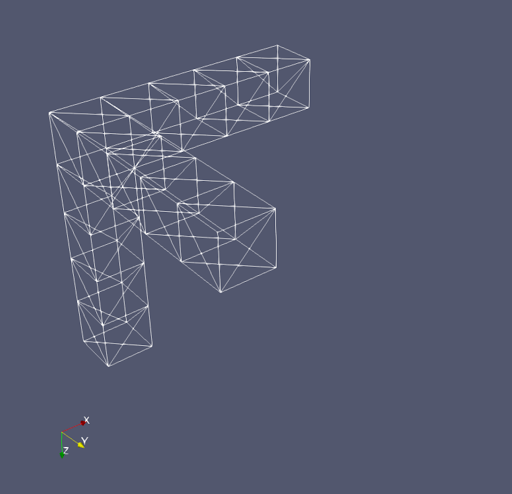
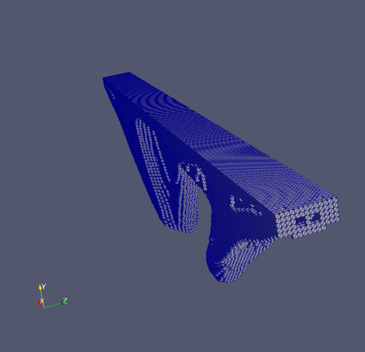

Christodoulos Fragkoudakis and Markos Karampatsis

> This report results from our research and development during our secondment in IDEA75 between 1/6/2021 and 31/11/2021. Our work program was “WP1” “Development of topology-sizing design optimization methodology incorporating nonlinear FEM analyses and machine learning” as described in Annex 1 of the Grant Agreement.

## A Python class for 3D Points

We will assemble a python class that represents 3D points and supports basic operations between its instances. We initialize an object of the Point class using three parameters, x, y, and z, the respective cartesian coordinates. The “coordinates” class property returns a three-valued Python tuple comprising the x, y, and z coordinates. We define two more methods to initialize the class, the `from_point` method that initializes a point instance from another point instance and the `from_tuple` method that initializes a point instance from a three-valued Python tuple. We represent a Point instance using the respective `Point(x,y,z)` string and define the `_hash_` function that ensures that two equal Point instances always return the same values.

```python
class Point(object):

  "A class for 3D points"
  def __init__(self, x, y, z):
    self.x = x
    self.y = y
    self.z = z

  @classmethod
  def from_point(cls, point):
      "Initializes a 3D point from another point"
      return cls(point.x, point.y, point.z)

  @classmethod
  def from_tuple(cls, tup):
      "Initializes a 3D point from a tuple of 3 values"
      return cls(tup[0], tup[1], tup[2])

  @property
  def coordinates(self):
      "Returns the coordinates of the 3D point"
      return self.x, self.y, self.z

  def __repr__(self):
      return 'Point({0},{1},{2})'.format(self.x, self.y, self.z)

  def __hash__(self):
      return hash((self.x, self.y, self.z))
```

Three-dimensional points, i.e., instances of the Point class, have the usual ordering according to their “coordinates” property. Two Point instances are equal if their coordinates tuples are equal, accordingly when they are not equal. A Point instance is “less” than another instance if the corresponding tuples have the exact ordering, respectively, when a Point instance is “greater” than another instance. We utilize Python tuples that inherently support lexicographic order to implement the above reasoning.

Our Point class supports coordinate iteration by the `__iter__` function, while positional coordinate getting and setting are possible, using the `__getitem__` and `__setitem__` functions.

```python
 def __eq__(self, other):
      if not other:
          return False
      return (self.x, self.y, self.z) == (other.x, other.y, other.z)

  def __ne__(self, other):
      if not other:
          return True
      return (self.x, self.y, self.z) != (other.x, other.y, other.z)

  def __lt__(self, other):
      return (self.x, self.y, self.z) < (other.x, other.y, other.z)

  def __gt__(self, other):
      return (self.x, self.y, self.z) > (other.x, other.y, other.z)

  def __le__(self, other):
      return (self.x, self.y, self.z) <= (other.x, other.y, other.z)

  def __ge__(self, other):
      return (self.x, self.y, self.z) >= (other.x, other.y, other.z)

  def __getitem__(self, index):
      return (self.x, self.y, self.z)[index]

  def __setitem__(self, index, value):
      temp = [self.x, self.y, self.z]
      temp[index] = value
      self.x, self.y, self.z = temp

  def __iter__(self):
      yield self.x
      yield self.y
      yield self.z

 def __sub__(self, other):
      "Subtracts two points giving the vector that anslates other to self."
      return Vector(other.x - self.x, other.y - self.y, other.z - self.z)

  def __add__(self, vector):
      "Translates self to another points using 'vector' vector"
      return Point(self.x + vector.x, self.y + vector.y,
                   self.z + vector.z)
```

Finally, our Point class supports subtraction between its instances and adding a Vector instance (to be defined later) to a Point instance. If we subtract two Point instances, we get the Vector that translates the first instance to the second. If we add a Vector instance to a Point instance, we get the translated Point instance.

## A Python class for 3D Vectors

Our Python class for 3D Vectors inherits the Point class and implements the essential property of magnitude. Notice that there is no need to employ a costly square root operation as two vectors have the same extent if the respective squared number is the same for both. Our class also supports the cross-product operation between two instances by a straightforward calculation of 6 multiplications and three additions.

```python
class Vector(Point):

    "A class for 3D Vectors"

    def __init__(self, *args):
        if not args:
            x, y, z = 0, 0, 0
        elif len(args) == 1:
            if args[0].__class__ is Point:
                x, y, z = args[0].x, args[0].y, args[0].z
            else:
                x, y, z = args[0], 0, 0
        elif len(args) == 2:
            x, y, z = args[0], args[1], 0
        else:
            x, y, z = args[0], args[1], args[2]
        self.coords = [x, y, z]
        super(Vector, self).__init__(x, y, z)

    def __repr__(self):
        return "Vector({1},{2},{3})".format(self.x, self.y, self.z)

    @property
    def magnitude2(self):
        "Returns the squared magnitude of the vector."
        return self.x**2 + self.y**2 + self.z**2

    def cross(self, vector):
        "Returns the cross product of self and vector"
        return Vector(
            (self.y * vector.z - self.z * vector.y),
            (self.z * vector.x - self.x * vector.z),
            (self.x * vector.y - self.y * vector.x))
```

An example usage of the Point and Vector classes in the Python interpreter is the following:

```
>>> from ucc2stl import Point, Vector
>>> x = Point(1,2,3)
>>> y = Point(4,5,6)
>>> x-y
Vector(3,3,3)
>>> z = Vector(3,3,3)
>>> x+z
Point(4,5,6)
```

## Unit cube complexes

The traditional Finite Element approach discretizes a continuous orthogonal domain into more minor elements of a specific shape. We consider unit cube complexes produced by various finite element analysis models. The constructed complexes are dense, and to 3D print them, we need to determine their outer shell, i.e., to calculate the complex's surface geometry.



The unit cube complex's surface is already a tesselation comprised of rectangles that have no overlaps or leave no gaps. Our purpose is to employ the STL file format specification, which is to tessellate the outer surface of the complex using triangles and store information about the triangles in a file. For example, the unit cube in the following image has two triangles per face, and since the cube has six faces, it adds up to twelve triangles. Many small triangles can also cover a 3D model of a sphere with a corresponding STL representation. Curved objects are out of the scope of our research, so that we will stick to rectangular constructions.



Let us fix a data structure that represents unit cubes. Consider a unit cube aligned to the cartesian coordinate system and that the "xz" plane represents a traditional map where the common practice defines the four points of the horizon. There are six primary directions towards each cube's face: north, south, east, west, top, and bottom. We label the cube's faces according to the direction.



We represent each labeled cube face as a counterclockwise or clockwise list of its vertices regarding its interior. We use a counterclockwise listing when the interior is below, left of, or behind the face. We use a clockwise listing when the interior is above, right, or in front of the face:



- The _north_ face is \\(0321\\)
- The _south_ face is \\(4567\\)
- The _east_ face is \\(6512\\)
- The _west_ face is \\(0473\\)
- The _top_ face is \\(3762\\)
- The _bottom_ face is \\(1265\\)

The centroid of a unit cube is simply the arithmetic mean of its vertices, and we calculate it twenty-four additions and three divisions:

$$
c=(x,y,z) = \left( \frac{\sum_{i=1}^8}{8}x_i, \frac{\sum_{i=1}^8}{8}y_i,
\frac{\sum_{i=1}^8}{8}z_i \right)
$$

We realize the centroid as the vector from \\((0,0,0)\\) towards the \\((x,y,z)\\) point. Given two unit cubes \\(C_1\\) and \\(C_2\\) in 3D space, there is a well-defined ordering if we consider the relative positions of the cubes’ centroids. We say that the unit cube \\(C_2\\) is “bigger than” the unit cube \\(C_1\\) if and only if their centroids respect the exact ordering \\(c_2>c_1\\). The relative position of the cube \\(C_2\\) might be right, or on top or, in front of the cube \\(C_1\\). The same reasoning also applies when we try to locate the immediate next of the unit cube \\(C\\) with centroid \\(c\\) along each of the \\(x\\), \\(y\\), \\(z\\) axes:

- The _west_ cube is around \\((x+1,y,z)\\)
- The _top_ cube is around \\((x,y+1,z)\\)
- The _south_ cube is around \\((x,y,z+1)\\)
- Similarly, for the _east_, _bottom_, and _north_ cubes.

## A Python class for unit cubes

Let us start by implementing a class that realizes the unit cube’s faces. Our unit cube complexes also comprise instances of collections of such faces, so it seems reasonable to define the normal function as a method that returns a Vector instance perpendicular to the respective plane.

```python
class Face(object):

    "A general representation of a complex's face"

    def __init__(self, vertices):
        "self.vertices is an iterable of Point"
        self.vertices = vertices

    def __repr__(self):
        _repr = "\nFace\n"
        for vertex in self.vertices:
            _repr += "\t%s\n" % vertex
        return _repr

    def normal(self):
        "A vector perpendicular to the face"
        v = self.vertices
        v1 = v[0] - v[1]
        v2 = v[0] - v[2]
        return v1.cross(v2)
```

A cuboid is a collection of six faces, the north, south, east, west, top, and bottom. We implement the face dictionary using the definitions given above: the face representation is a counterclockwise listing of its vertices when the interior of the cuboid is below, left, or behind the face. Otherwise, it is a clockwise listing of vertices. The centroid of the cuboid is the weighted average of the cuboid’s vertices.

We compare cuboids by utilizing the already implemented comparison between instances of the Point class. So to compare cuboids, we compare their centroids using the reasoning we described above. To translate an instance relative to a given vector v, we simply iterate over the vertices and translate each vertex using the given vector.

```python
class Cuboid(object):
    "A class for cuboids"
    def __init__(self, vertices):
        self.vertices = sorted(vertices)
        v = self.vertices
        self.facedict = {
            "north": Face([v[0], v[2], v[6], v[4]]),
            "south": Face([v[1], v[5], v[7], v[3]]),
            "east": Face([v[5], v[4], v[6], v[7]]),
            "west": Face([v[0], v[1], v[3], v[2]]),
            "top": Face([v[6], v[2], v[3], v[7]]),
            "bottom": Face([v[0], v[4], v[5], v[1]]),
        }

    def __repr__(self):
        _repr = "\nCuboid:\n--------\nVertices\n--------\n"
        for vertex in self.vertices:
            _repr += "\t%s\n" % vertex
        _repr += "-----\nFaces\n-----\n"
        for orientation, face in self.faces:
            _repr += "{0}: {1}".format(orientation, face)
        return _repr

    def __eq__(self, other):
        return self.centroid == other.centroid

    def __ne__(self, other):
        return self.centroid != other.centroid

    def __lt__(self, other):
        return self.centroid < other.centroid

    def __qt__(self, other):
        return self.centroid > other.centroid

    def __le__(self, other):
        return self.centroid <= other.centroid

    def __ge__(self, other):
        return self.centroid >= other.centroid

    @property
    def faces(self):
        "docstring"
        for orientation, face in self.facedict.items():
            yield orientation, face

    @property
    def centroid(self):
        "Returns the centroid of the cuboid"
        x, y, z = 0.0, 0.0, 0.0
        for vertex in self.vertices:
            x += vertex.x
            y += vertex.y
            z += vertex.z
        return Point(x / 8.0, y / 8.0, z / 8.0)

    def translate(self, vector):
        translated = [vertex + vector for vertex in self.vertices]
        return Cuboid(translated)
```

Let us use our classes and create two cuboids. We make the first one by explicitly defining its eight vertices, while the second one is a translation of the first using the \\((1,1,1)\\) vector. We print the cuboids and finally check their order.

```python
from ucc2stl.cuboids import Cuboid
from ucc2stl import Point, Vector

x0 = Point(0, 0, 0)
x1 = Point(1, 0, 0)
x2 = Point(1, 1, 0)
x3 = Point(0, 1, 0)
x4 = Point(0, 0, 1)
x5 = Point(1, 0, 1)
x6 = Point(1, 1, 1)
x7 = Point(0, 1, 1)

cuboid0 = Cuboid([x0, x1, x2, x3, x4, x5, x6, x7])
vector = Vector(1, 1, 1)
cuboid1 = cuboid0.translate(vector)

print(cuboid0, cuboid1)
print(cuboid0.centroid, cuboid1.centroid, cuboid0 < cuboid1, cuboid0 > cuboid1)
```

We include the above script’s output by representing the cuboids side by side for comparison and space economy.

```
 Cuboid:       Cuboid:
 --------      --------
 Vertices      Vertices
 --------      --------
 Point(0,0,0)  Point(1,1,1)
 Point(0,0,1)  Point(1,1,2)
 Point(0,1,0)  Point(1,2,1)
 Point(0,1,1)  Point(1,2,2)
 Point(1,0,0)  Point(2,1,1)
 Point(1,0,1)  Point(2,1,2)
 Point(1,1,0)  Point(2,2,1)
 Point(1,1,1)  Point(2,2,2)
 ----------    ----------
 north Face    north Face
 ----------    ----------
 Point(0,0,0)  Point(1,1,1)
 Point(0,1,0)  Point(1,2,1)
 Point(1,1,0)  Point(2,2,1)
 Point(1,0,0)  Point(2,1,1)
 ----------    ----------
 south Face    south Face
 ----------    ----------
 Point(0,0,1)  Point(1,1,2)
 Point(1,0,1)  Point(2,1,2)
 Point(1,1,1)  Point(2,2,2)
 Point(0,1,1)  Point(1,2,2)
 ---------     ---------
 east Face     east Face
 ---------     ---------
 Point(1,0,1)  Point(2,1,2)
 Point(1,0,0)  Point(2,1,1)
 Point(1,1,0)  Point(2,2,1)
 Point(1,1,1)  Point(2,2,2)
 ---------     ---------
 west Face     west Face
 ---------     ---------
 Point(0,0,0)  Point(1,1,1)
 Point(0,0,1)  Point(1,1,2)
 Point(0,1,1)  Point(1,2,2)
 Point(0,1,0)  Point(1,2,1)
 --------      --------
 top Face      top Face
 --------      --------
 Point(1,1,0)  Point(2,2,1)
 Point(0,1,0)  Point(1,2,1)
 Point(0,1,1)  Point(1,2,2)
 Point(1,1,1)  Point(2,2,2)
 -----------   -----------
 bottom Face   bottom Face
 -----------   -----------
 Point(0,0,0)  Point(1,1,1)
 Point(1,0,0)  Point(2,1,1)
 Point(1,0,1)  Point(2,1,2)
 Point(0,0,1)  Point(1,1,2)

 Point(0.5,0.5,0.5) Point(1.5,1.5,1.5) True False
```

## A Python class for cuboid complexes

We are now ready to capitalize on our already made classes and assemble a Python class that handles unit cube complexes in 3D space. We initialize an instance of CuboidComplex by passing as a parameter an iterable of cuboids, each indexed using its centroid into the instance’s `cubdict` attribute. We initialize the triangle and vertex lists that comprise the final complex as empty lists.

```python
class CuboidComplex(object):
    """ A class that handles unit cube complexes in 3D space """

    def __init__(self, cuboids):
        self.cubdict = dict()
        self.shell_triangles = list()
        self.shell_vertices = list()
        print("Started inserting cuboids ... ", end="")
        for cuboid in cuboids:
            self.insert(Cuboid(cuboid))
        print("Done inserting {} cuboids".format(len(cuboids)))
```

Let us focus on the insert method that uses the `cubdict` dictionary to hold the data of the inserted cuboids, indexed by their centroid. The dictionary’s key is the cuboid’s centroid, while the data indexed is another dictionary indexed by the cuboid’s faces orientation. The indexed data are the face itself and a boolean indication of whether it is outer or not. Imagine here that we need to insert every given cuboid and that the very first cuboid comprises a complex with six outer faces.

Our next task is to identify all the immediate neighbors of the inserted cuboid. Our `cubdict` dictionary is a handy construct as we can locate them by looking towards the six faces orientation of the inserted cuboid. To that direction, we calculate the neighbors’ indexes, i.e., the neighbors’ centroids, as already described. If the currently inserted cuboid has actual neighbors in the complex, their centroids must already be indexes of the `cubdict` dictionary.

Our last task is to update the complex’s faces’ boolean `out` indicator. If a cuboid is on _top_ of the inserted one, then the inserted cuboid’s top face and the neighbor’s bottom face reside inside the complex. If there is a cuboid _west_ of the inserted one, then the inserted cuboid’s west face and the neighbor’s east face both reside inside the complex. The same reasoning applies to every other direction by refreshing the touching faces as inside ones, i.e., updating the boolean `out` indicator. These operations are well-defined and repeatedly performed for every inserted cuboid. It must now be evident that after the insertion of the last cuboid, our `cubdict` construct holds all the complex’s faces, and for every face, the correct indicator of whether the face is outer or not.

```python
    def insert(self, cuboid):
        """ Inserts a cuboid into the complex keeping track of outer Faces """
        cuboid_id = cuboid.centroid  # id is an instance of Point
        self.cubdict[cuboid_id] = {}
        for orientation, face in cuboid.faces:
            self.cubdict[cuboid_id][orientation] = {"face": face, "out": True}
        x, y, z = cuboid_id.x, cuboid_id.y, cuboid_id.z
        top_id = Point(x, y + 1, z)
        bottom_id = Point(x, y - 1, z)
        west_id = Point(x - 1, y, z)
        east_id = Point(x + 1, y, z)
        north_id = Point(x, y, z - 1)
        south_id = Point(x, y, z + 1)
        if top_id in self.cubdict:
            self.cubdict[top_id]["bottom"]["out"] = False
            self.cubdict[cuboid_id]["top"]["out"] = False
        if bottom_id in self.cubdict:
            self.cubdict[bottom_id]["top"]["out"] = False
            self.cubdict[cuboid_id]["bottom"]["out"] = False
        if west_id in self.cubdict:
            self.cubdict[west_id]["east"]["out"] = False
            self.cubdict[cuboid_id]["west"]["out"] = False
        if east_id in self.cubdict:
            self.cubdict[east_id]["west"]["out"] = False
            self.cubdict[cuboid_id]["east"]["out"] = False
        if north_id in self.cubdict:
            self.cubdict[north_id]["south"]["out"] = False
            self.cubdict[cuboid_id]["north"]["out"] = False
        if south_id in self.cubdict:
            self.cubdict[south_id]["north"]["out"] = False
            self.cubdict[cuboid_id]["south"]["out"] = False
```

We are now ready to calculate the complex’s outer shell vertices and triangles. To that end, we iterate over the `cubdict` dictionary items. We are only interested in outer faces, so we take action only when we find an appropriate `out` indicator. A local `vdict` dictionary construct keeps track of already found vertices to avoid inserting the same vertex to the shell’s vertices list more than once. When we process an outer face, we iterate over its vertices to update the shell’s vertices and identify the two triangles that comprise the face. We finally insert the triangles into the shell’s triangle list.

```python
    def shell(self):
        """ Calculates the outer shell vertices and triangles """
        print("Started outer shell calculation  ... ", end="")
        vdict = dict()
        nvs = -1
        for cuboid, faces_info in self.cubdict.items():
            for face_label, face_info in faces_info.items():
                if face_info["out"]:
                    tface = []
                    for vertex in face_info["face"].vertices:
                        coords = (vertex.x, vertex.y, vertex.z)
                        if coords not in vdict:
                            nvs += 1
                            self.shell_vertices.append(coords)
                            vdict[coords] = nvs
                        tface.append(vdict[coords])
                    tri1 = [tface[0], tface[1], tface[2]]
                    tri2 = [tface[2], tface[3], tface[0]]
                    self.shell_triangles += [tri1, tri2]
        print(
            "Done\nThere are {} vertices and {} triangles".format(
                len(self.shell_vertices), len(self.shell_triangles)
            )
        )
```

To export the shell’s representation into the STL file format, we use the excellent `numpy-stl` Python module. We import the module’s mesh library that constructs STL meshes by utilizing our already calculated list of shell’s vertices and triangles. We save the calculated mesh to the `model.stl` file.

```python
    def export_stl(self):
        vertices = np.array(self.shell_vertices)
        faces = np.array(self.shell_triangles)
        stlmesh = mesh.Mesh(np.zeros(faces.shape[0], dtype=mesh.Mesh.dtype))
        for i, f in enumerate(faces):
            for j in range(3):
                stlmesh.vectors[i][j] = vertices[f[j], :]
        stlmesh.save("model.stl")
```

## Test cases of unit cube complexes

Let us now check various test cases regarding the usage of our CuboidComplex class. We will present the Python code and the resulting STL file. To produce the shown images, we inserted the generated STL mesh into the Paraview and exported the scene into a PDF file. Then we converted the PDF file to a PNG using the pdftoppm Linux utility.

### A cube

```python
from ucc2stl.cuboids import Cuboid, CuboidComplex
from ucc2stl import Point, Vector

x0 = Point(0, 0, 0)
x1 = Point(1, 0, 0)
x2 = Point(1, 1, 0)
x3 = Point(0, 1, 0)
x4 = Point(0, 0, 1)
x5 = Point(1, 0, 1)
x6 = Point(1, 1, 1)
x7 = Point(0, 1, 1)

cuboid = Cuboid([x0, x1, x2, x3, x4, x5, x6, x7])
complex = CuboidComplex([cuboid.vertices])
complex.shell()
complex.export_stl()
```

```
Started inserting cuboids ... Done inserting 1 cuboids
Started outer shell calculation  ... Done
There are 8 vertices and 12 triangles.
```



### Two cubes side by side

```python
from ucc2stl.cuboids import Cuboid, CuboidComplex
from ucc2stl import Point, Vector

x0 = Point(0, 0, 0)
x1 = Point(1, 0, 0)
x2 = Point(1, 1, 0)
x3 = Point(0, 1, 0)
x4 = Point(0, 0, 1)
x5 = Point(1, 0, 1)
x6 = Point(1, 1, 1)
x7 = Point(0, 1, 1)

cuboid_list = []
cuboid0 = Cuboid([x0, x1, x2, x3, x4, x5, x6, x7])
vector = Vector(1,0,0)
cuboid1 = cuboid0.translate(vector)
complex = CuboidComplex([cuboid0.vertices, cuboid1.vertices])
complex.shell()
complex.export_stl()
```

```
Started inserting cuboids ... Done inserting 2 cuboids
Started outer shell calculation  ... Done
There are 12 vertices and 20 triangles.
```


### Four cubes side by side

```python
from ucc2stl.cuboids import Cuboid, CuboidComplex
from ucc2stl import Point, Vector

x0 = Point(0, 0, 0)
x1 = Point(1, 0, 0)
x2 = Point(1, 1, 0)
x3 = Point(0, 1, 0)
x4 = Point(0, 0, 1)
x5 = Point(1, 0, 1)
x6 = Point(1, 1, 1)
x7 = Point(0, 1, 1)

cuboid = Cuboid([x0, x1, x2, x3, x4, x5, x6, x7])
cuboid_list = [cuboid]
translation_vectors = [
    Vector(1, 0, 0),
    Vector(0, 0, 1),
    Vector(1, 0, 1)
]

for vector in translation_vectors:
    cuboid_list.append(cuboid.translate(vector))

complex = CuboidComplex([cuboid.vertices for
                         cuboid in cuboid_list])
complex.shell()
complex.export_stl()
```

```
Started inserting cuboids ... Done inserting 4 cuboids
Started outer shell calculation  ... Done
There are 18 vertices and 32 triangles.
```



### Three connected columns

```python
from ucc2stl.cuboids import Cuboid, CuboidComplex
from ucc2stl import Point, Vector

x0 = Point(0, 0, 0)
x1 = Point(1, 0, 0)
x2 = Point(1, 1, 0)
x3 = Point(0, 1, 0)
x4 = Point(0, 0, 1)
x5 = Point(1, 0, 1)
x6 = Point(1, 1, 1)
x7 = Point(0, 1, 1)

cuboid = Cuboid([x0, x1, x2, x3, x4, x5, x6, x7])
cuboid_list = [cuboid]

for i in range(4):
    current = Cuboid(cuboid.vertices)
    for j in range(4):
        current = Cuboid(cuboid.vertices)
        for k in range(4):
            if i == 0:
                vector = Vector(1, 0, 0)
            elif j == 0:
                vector = Vector(0, 1, 0)
            else:
                vector = Vector(0, 0, 1)
            current = current.translate(vector)
            cuboid_list.append(current)

complex = CuboidComplex([cuboid.vertices for cuboid in cuboid_list])
complex.shell()
complex.export_stl()
```

```
Started inserting cuboids ... Done inserting 65 cuboids
Started outer shell calculation  ... Done
There are 56 vertices and 108 triangles.
```



## Converting the nodes, connectivity, density representation to Python lists

A usual representation of finite element methods analysis results is the nodes-connectivity representation. As a result of an optimization process, there is an extra density parameter for every connectivity construct. We developed helper functions to convert this information to use Python lists representations.

```python
def csv2list(afile, atype, prepend_dummy=False):
    "afile is a csv file of atype values, returns a list of tuples"
    print("Opening {} ... ".format(afile), end="")
    alist = []
    for line in open(afile):
        line2list = line.strip().split(",")
        if len(line2list) > 1:
            alist.append(tuple(atype(i) for i in line2list))
        else:
            alist.append(atype(line2list[0]))
    print("Read {} values".format(len(alist)))
    if prepend_dummy:
        alist.insert(0, (0, 0, 0))
    return alist

def dense_cuboids(nodes_file, connectivity_file, density_file, threshold):
    """returns a list of the 'dense' cuboids"""
    alist = []
    nodes = csv2list(nodes_file, int, prepend_dummy=True)
    connectivity = csv2list(connectivity_file, int)
    density = csv2list(density_file, float)
    print("Filtering dense cuboids ...", end="")
    for atuple in zip(density, connectivity):
        if atuple[0] - threshold > EPSILON:  # cuboid is 'dense enough'
            cuboid = []
            for vertex in atuple[1]:
                cuboid.append(Point.from_tuple(nodes[vertex]))
            alist.append(cuboid)
    print("Filtered {} dense cuboids".format(len(alist)))
    return alist
```

We had a set of nodes-connectivity-density files regarding the optimization output of a finite element analysis process. We utilized the above helper functions to convert this set of files to a suitable input of our CuboidComplex class.

```python
from ucc2stl import dense_cuboids, CuboidComplex

cuboids = dense_cuboids("Node.txt", "Connectivity.txt", "density.txt", 0.3)
complex = CuboidComplex(cuboids)
complex.shell()
complex.export_stl()
```

```
Opening Node.txt ... Read 129444 values
Opening Connectivity.txt ... Read 117000 values
Opening density.txt ... Read 117000 values
Filtering dense cuboids ...Filtered 37148 dense cuboids
Started inserting cuboids ... Done inserting 37148 cuboids
Started outer shell calculation  ... Done
There are 25264 vertices and 50572 triangles.
```

The picture of the resulting STL file output is the following:


