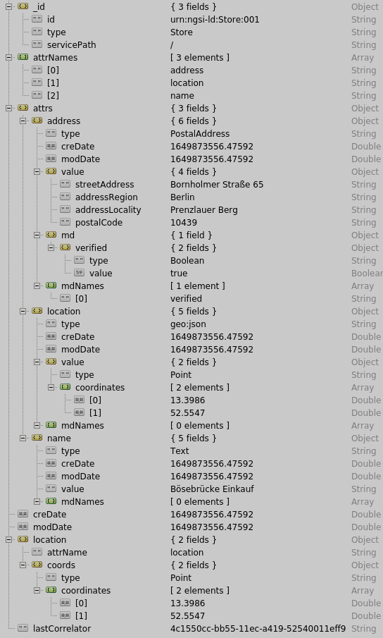

## The FIWARE ecosystem

There is vast chaos of available software technologies regarding possible
approaches to a Digital Twin implementation. I am a complete newbie in the area,
having a background in computer science and IT implementations in [NTUA][ntua].
It is a fortunate coincidence that I can capitalize on my experience and
immediately utilize the plethora of excellent available tools and practices,
most notably the [FIWARE][fiware] ecosystem.

The heart of any Digital Twin implementation is a system for managing context
information. The [Orion Context Broker][orion context broker] enables the
management of context information in a highly decentralized and large-scale
manner. It provides the [FIWARE NGSI v2 API][ngsi v2 api] that allows updates,
queries, or subscriptions to changes in context information.

## Installing Orion

The FIWARE ecosystem has excellent and detailed documentation providing all the
necessary steps for the immediate utilization of its components. I started by
manually installing the Orion Context Broker on a [Debian][debian] 11 virtual
machine, following the available installation [instructions][orion on debian].
The installation process was straightforward and more or less as described in
the instructions.

The described procedure for testing and coverage is also detailed, but there are
some minor glitches regarding the Python virtual environment for the functional
tests. I managed to improvise workarounds and install all the mandatory software
for performing the available tests. Afterward, the testing process is extensive
and requires time and patience. I successfully ran the unit tests, but the
functional and harness tests are numerous and take forever. I decided to stop
the testing process and get back to it after the successful adoption of Orion
Context Broker in a proof of concept Digital Twin implementation.

After the installation process, I invoked the broker version message, and
everything seemed OK.

```
$ curl -X GET 'http://localhost:1026/version'
```

```json
{
  "orion": {
    "version": "3.6.0-next",
    "uptime": "0 d, 10 h, 25 m, 15 s",
    "git_hash": "ecb1c1daf4b00d6c137f49ac0512100d88d1afe7",
    "compile_time": "Tue Apr 12 20:25:47 EEST 2022",
    "compiled_by": "oper",
    "compiled_in": "impetus",
    "release_date": "Tue Apr 12 20:25:47 EEST 2022",
    "machine": "x86_64",
    "doc": "https://fiware-orion.rtfd.io/",
    "libversions": {
      "boost": "1_74",
      "libcurl": "libcurl/7.74.0 OpenSSL/1.1.1n zlib/1.2.11 brotli/1.0.9 libidn2/2.3.0 libpsl/0.21.0 (+libidn2/2.3.0) libssh2/1.9.0 nghttp2/1.43.0 librtmp/2.3",
      "libmosquitto": "2.0.12",
      "libmicrohttpd": "0.9.70",
      "openssl": "1.1",
      "rapidjson": "1.1.0",
      "mongoc": "1.17.4",
      "bson": "1.17.4"
    }
  }
}
```

## First tests and interactions

I decided to employ Python with the [requests][python requests] module for my
early interactions with the just-installed Orion Context Broker. Following the
[getting started][getting started] instructions, I created two new entities
representing stores in Berlin. Any entity in Orion must have an `id` and `type`
attributes, while additional details are optional and depend on the described
system. Each other piece of information should define at least a `type` and a
`value` attribute. Let's insert our first store.

### Insert an entity

```python
import requests

url = "http://localhost:1026/v2/entities"

payload = {
  "id": "urn:ngsi-ld:Store:001",
  "type": "Store",
  "address": {
    "type": "PostalAddress",
    "value": {
      "streetAddress": "Bornholmer Straße 65",
      "addressRegion": "Berlin",
      "addressLocality": "Prenzlauer Berg",
      "postalCode": "10439",
    },
    "metadata": {"verified": {"value": True, "type": "Boolean"}},
  },
  "location": {
    "type": "geo:json",
    "value": {"type": "Point", "coordinates": [13.3986, 52.5547]},
  },
  "name": {"type": "Text", "value": "Bösebrücke Einkauf"},
}

r = requests.post(url, json=payload)

print(r.status_code)
```

The `201` status code indicates a successful insertion. Let's examine what
happened behind the scenes by checking the underlying [MongoDB][mongo db]
through the [Robo3T client][robomongo]:



First, the `attrNames` array contains the three attributes that characterize the
Store entity, i.e., _address_, _location_, and _name_, as string literals. A
subobject `attrs` further describes our entity by elaborating on the details
using the relevant payload values. The `md` key contains a subobject with the
metadata, while the `mdNames` array contains the metadata keys as string
literals. Observe that the type and value attributes are respected for each
piece of information and augmented with creation and modification timestamps.

The _location_ key contains _GeoJSON_ data in our payload. Orion handled this
data differently by creating a top-level location attribute containing a
subobject that describes a point that respects the original payload's
information. Finally, the `lastCorrelator` attribute is the value of the root
correlator in the last update request on the entity. Orion's self-notification
loop protection logic uses it.

[ntua]: http://www.ntua.gr
[fiware]: https://www.fiware.org/
[orion context broker]: https://github.com/telefonicaid/fiware-orion/
[ngsi v2 api]: http://telefonicaid.github.io/fiware-orion/api/v2/stable/
[debian]: https://www.debian.org
[orion on debian]:
  https://fiware-orion.readthedocs.io/en/master/admin/build_source/index.html
[python requests]: https://docs.python-requests.org/en/latest/
[getting started]:
  https://github.com/Fiware/tutorials.Getting-Started/blob/master/README.md
[mongo db]: https://www.mongodb.com/
[robomongo]: https://robomongo.org/
