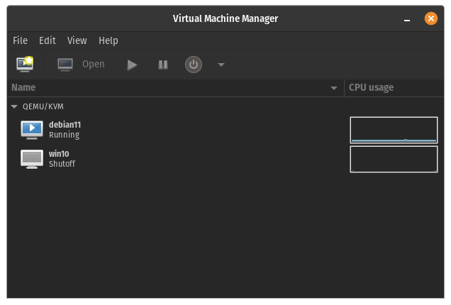

In case you need a DHCP reservation for a kvm virtual machine, say for the `debian11` one, you should first find the machine's mac address:

```
$ virsh  dumpxml  debian11 | grep 'mac address'

      <mac address='52:54:00:6a:c0:15'/>
```

Then find the network name:

```
virsh net-list
 Name      State    Autostart   Persistent
--------------------------------------------
 default   active   yes         yes
```

and edit the XML configuration:

```
$ virsh net-edit default
```

```xml
<network>
 <name>default</name>
 <uuid>f2e7f420-1cf3-4535-8469-d3dfdaaf9ffc</uuid>
 <forward mode='nat'/>
 <bridge name='virbr0' stp='on' delay='0'/>
 <mac address='52:54:00:a9:7e:b5'/>
 <ip address='192.168.122.1' netmask='255.255.255.0'>
   <dhcp>
     <range start='192.168.122.200' end='192.168.122.254'/>
     <host mac='52:54:00:6a:c0:15' name='debian11' ip='192.168.122.2'/>
   </dhcp>
 </ip>
</network>
```

Then restart the host machine.
