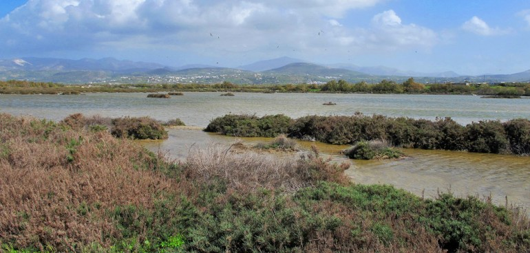

Διήγηση του αείμνηστου πατέρα μου Γιώργου Φραγκουδάκη:

Δίπλα στη δυτική πλευρά του σημερινού αεροδρομίου, το έδαφος ήταν αμμώδες, επίπεδο και το υψόμετρο ήταν ελάχιστο. Το έλουζε η αλμύρα της διπλανής θάλασσας και γι’ αυτό ήταν τελείως ακατάλληλο για γεωργική εκμετάλευση. Εκεί υπήρχαν όλες οι προϋποθέσεις για να δημιουργηθούν και λειτουργήσουν οι αλυκές της Νάξου.

Έμπειροι αγροτοεργάτες από το διπλανό χωριό το Αγερσανί ανοίγουν στν άμμο λεκάνες σε σχήμα ορθογώνιο, αρκετού μήκους και πλάτους, που είχαν βάθος εβδομήντα εκατοστά περίπου. Με κατάλληλα κανάλια, το θαλασσινό νερό κυλούσε στις λεκάνες και σχεδόν τις γέμιζε. Αυτά γίνονταν στα μέσα της Άνοιξης. Έκλειναν τα θαλασσινά κανάλια. Το ρεύμα των ξηρών βοριάδων, οι ατέλειωτες ηλιόλουστες μέρες, η αυξημένη θερμοκρασία, εξάτμιζαν σύντομα το θαλασσινό νερό. Τότε οι πυθμένες και τα πλάγια τοιχώματα των λεκανών καλύπτονταν από κάτασπρο κρυσταλικό, ολοκάθαρο φυσικό αλάτι. Σε λίγο άρχιζε η συγκομιδή του προϊόντος. Πολλοί εργάτες με προσοχή, για να μην ανακατευτεί με την άμμο, το μάζευαν και το τοποθετούσαν σε διπλανό καθαρό μέρος, σε σχήμα κόλουρης τετραγωνικής πυραμίδας.

Δεν περνούσαν πολλές μέρες και στο λιμάνι της Νάξου άραζαν τα καϊκια που θα το μετέφεραν στον Πειραιά ή στ’ άλλα λιμάνια. Τότε ξεκινούσε το μεγάλο θέαμα. Δεκάδες εργάτες γέμιζαν με αλάτι τα τσουβάλια, τα έδεναν και γαϊδούρια χωρίς σαμάρι φορτώνονταν. Υπήρχε μια καθιερωμένη αρχή. Το τσουβάλι έπρεπε να γέρνει προς το μέρος του δεσίματος, διότι σε αντίθετη περίπτωση θα έπεφτε από τη ράχη του ζώου: “Όταν γέρνει με τον πάτο, δέξου το τσουβάλι κάτω”.

Σχηματιζόταν μια πολύ μεγάλη ουρά από έμφορτα γαϊδούρια και αγωγιάτες. Ακολουθούσαν την άκρη της αμμουδιάς, εκεί που η θάλασσα χάιδευε απαλά, γλυκά την άμμο. Η ουρά προχωρούσε, έφτανε στα Ποριά, μερνούσε τον Κόττη και σε λίγο βρισκόταν στην ανατολική πλευρά του σημερινού νεκροταφείου και δίπλα από το Χάνι και την Ένωση Γεωργικών Συνεταιρισμών, έμπαινε στον παραλιακό δρόμο του Λιμανιού. Τα καϊκια περίμεναν στη σκάλα, απένταντι από το εκκλησάκι της Μυρτιδιώτισσας. Τα τσουβάλια ανοίγονταν και τ’ αλάτι ριχνόταν στο αμπάρι. Ο αγωγιάτης έπερνε τ’ αδειανό σακί και ξανάπερνε το δρόμο της επιστροφής στην αλυκή να ξαναγεμίσει και να καναπάρει τον ίδιο δρόμο …

Ήταν μια από τις δραστηριότητες του νησιού που συντελούσε αρκετά στη βελτίωση της οικονομικής θέσης, μερίδας, των κατοίκων του νησιού.
