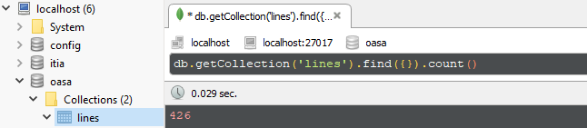
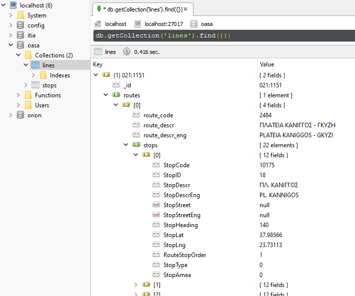
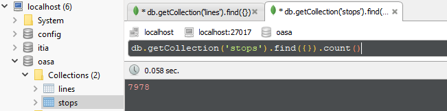
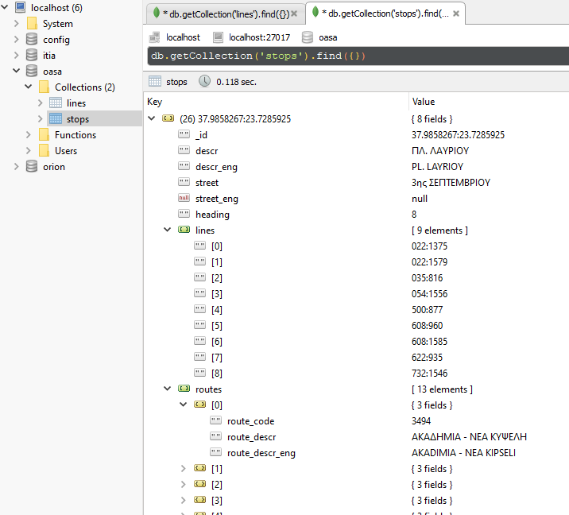
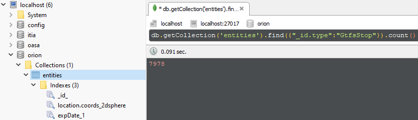
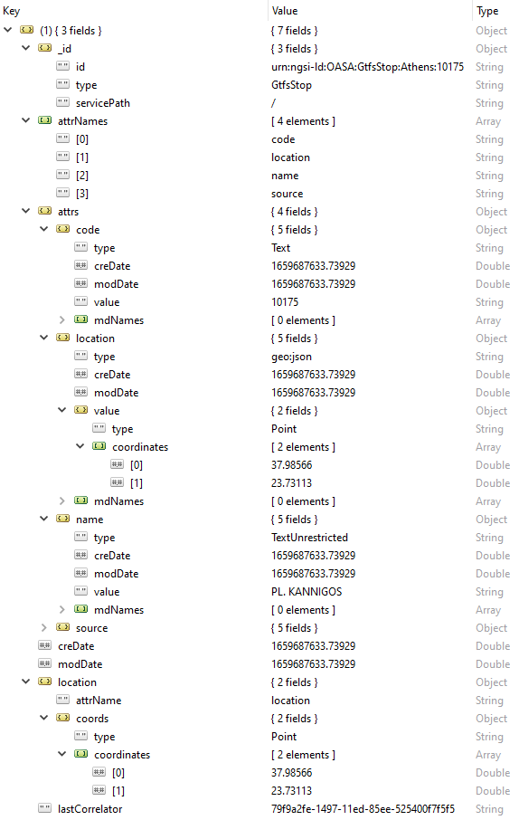

[](http://creativecommons.org/licenses/by-sa/4.0/)
I document how I utilized the [FIWARE][fiware] ecosystem to develop a Digital Twin for the NTUA Campus. I provide my work for disseminating knowledge about FIWARE under the [Creative Commons Attribution-ShareAlike 4.0](http://creativecommons.org/licenses/by-sa/4.0/) International License.

## Introduction

This paper documents the approach of [Urban Water Management and Hydroinformatcs Group][uwmh] in [NTUA][ntua] to create a Digital Twin for the NTUA campus. We chose to employ the [FIWARE][fiware] tools ecosystem and apply the necessary technical glue for the assembly of a Digital Twin data representation of NTUA's campus environment.

We combine information from many different sources, including a weather station, public transportation telemetry, energy consumption sensors, and programmable logic controller data from the municipal sewer mining installation for the watering of the municipal plant nursery. We constantly synchronize our databases with the data sources, and information is accessible in almost real-time. Almost real-time in the sense that the interval between the instants of time at which the data is gathered and made accessible is short enough for a current digital snapshot of the NTUA campus.

Various applications constantly process and analyze current data values and generated history over time.

... ELABORATE ...

## The FIWARE ecosystem

There are a lot of available software technologies regarding possible approaches to a Digital Twin implementation. It was a fortunate coincidence that we could capitalize on our systems and network administration experience and immediately utilize the plethora of excellent tools and practices of the [FIWARE][fiware] ecosystem.

The heart of any Digital Twin implementation is a system for managing context information. The [Orion Context Broker][orion context broker] enables the management of context information in a highly decentralized and large-scale manner. It provides the FIWARE [NGSI v2 API][ngsi v2 api] that allows updates, queries, or subscriptions to changes in context information.

### Installing Orion

The FIWARE ecosystem generally has excellent and detailed documentation providing all the necessary steps for the immediate utilization of its components. We started by manually installing the Orion Context Broker on a [Debian][debian] 11 virtual machine, following the installation [instructions][orion on debian]. The installation process was straightforward and more or less as described in the instructions.

The described procedure for testing and coverage is also detailed, but there are minor glitches regarding the Python virtual environment for the functional tests. We improvised on-the-spot workarounds and installed the mandatory software for performing the available tests. Afterward, the testing process is extensive and requires time and patience. We successfully run the unit tests, but the functional and harness tests are numerous and take forever. We decided to stop the testing process and get back to it in case we run into problems during our Digital Twin development.

After the installation process, we started Orion and invoked the broker version message. The output was as described in the documentation and depicted various pieces of information about the installation.

```
$ curl -X GET 'http://localhost:1026/version'
```

```json
{
  "orion": {
    "version": "3.7.0-next",
    "uptime": "1 d, 22 h, 44 m, 48 s",
    "git_hash": "fad1b89e34f708647adf034b746beba4c1bd63d8",
    "compile_time": "Mon Jul 18 23:30:49 EEST 2022",
    "compiled_by": "root",
    "compiled_in": "ntuadt-debian11",
    "release_date": "Mon Jul 18 23:30:49 EEST 2022",
    "machine": "x86_64",
    "doc": "https://fiware-orion.rtfd.io/",
    "libversions": {
      "boost": "1_74",
      "libcurl": "libcurl/7.74.0 OpenSSL/1.1.1n zlib/1.2.11 brotli/1.0.9 libidn2/2.3.0 libpsl/0.21.0 (+libidn2/2.3.0) libssh2/1.9.0 nghttp2/1.43.0 librtmp/2.3",
      "libmosquitto": "2.0.12",
      "libmicrohttpd": "0.9.70",
      "openssl": "1.1",
      "rapidjson": "1.1.0",
      "mongoc": "1.17.4",
      "bson": "1.17.4"
    }
  }
}
```

Currently, the only possible way to interact with Orion is using an HTTP client from localhost. Orion listens to incoming requests at port 1026 and interacts with [MongoDB][mongodb] at localhost at port 27017.

<!-- prettier-ignore -->

flowchart LR
    CURL[HTTP client] <---> |1026:1026| ORION[Orion<br>Context<br>Broker]
    ORION <---> |27017:27017| MONGO[(MongoDB)]
    style ORION fill:#f9f,stroke:#333,stroke-width:4px


#### Creating a Debian service

In order to install Orion as a Debian service, we have to create a user and a file in the appropriate system directory.

```
$ sudo useradd -M orion
$ sudo usermod -L orion
$ sudo vim /etc/systemd/system/contextBroker.service
```

We need at least the following setup:

```ini
[Unit]
Description=Orion Context Broker Service

[Service]
User=orion
ExecStart=contextBroker
Restart=always

[Install]
WantedBy=multi-user.target
```

Finally enable and start the new service:

```
$ sudo systemctl daemon-reload
$ sudo systemctl enable contextBroker.service
$ sudo systemctl start contextBroker.service
$ sudo systemctl status contextBroker.service
```

The outcome must be something like:

```
● contextBroker.service - Orion Context Broker Service
     Loaded: loaded (/etc/systemd/system/contextBroker.service; enabled; vendor preset: enabled)
     Active: active (running) since Tue 2022-07-19 10:09:06 EEST; 3 days ago
   Main PID: 437 (contextBroker)
      Tasks: 4 (limit: 19172)
     Memory: 14.6M
        CPU: 4.100s
     CGroup: /system.slice/contextBroker.service
             └─437 contextBroker

Jul 19 10:09:06 ntuadt-debian11 systemd[1]: Started Orion Context Broker Service.
```

#### The Orion wrapper scripts

To interact with Orion, we use the following Python scripts that wrap the HTTP request details under meaningful function names. We define an iterator that yields Orion entities up to a specific limit imposed by the context broker. The default limit value is 20 and must be at most 1000. To update an entity, we use the payload object that usually originates from intermediate MongoDB sources (more on the intermediate sources later). We must [omit][entity update] the id and type key-value pairs for a successful update.

```python
def get_all_orion_entities(limit=20):
    r = requests.get(f"{ORION_URL}?limit={limit if limit < 1000 else 1000}")
    for entity in r.json():
        yield entity


def get_orion_entity(entity_id):
    r = requests.get(f"{ORION_URL}/{entity_id}")
    print(r.status_code, r.text)
    if r.status_code == 200:
        return r.json()


def delete_orion_entity(entity_id):
    r = requests.delete(f"{ORION_URL}/{entity_id}")
    print(r.status_code, r.text)


def insert_orion_entity(payload):
    r = requests.post(ORION_URL, json=payload)
    print(r.status_code, r.text)


def update_orion_entity(payload):
    update_url = f"{ORION_URL}/{payload['id']}/attrs"
    pload = {
        key: value
        for (key, value) in payload.items()
        if key not in ["id", "type"]
    }
    r = requests.patch(update_url, json=pload)
    print(r.status_code, r.text)
```

### The Smart Data Models Initiative

FIWARE Foundation, TM Forum, IUDX, and OASC lead a [collaborative initiative][smart data model] to support the adoption of a reference architecture and compatible standard data models. A Smart Data Model includes the technical representation that defines the specialized data types and structure, a human-readable specification, and examples of the payloads for NGSI v2 API calls.

On the NTUA campus, there are several data sources for our Digital Twin proof of concept. There are two weather stations, public transportation telemetry, public transportation static data, and building energy consumption telemetry. Around the corner of NTUA's campus is a sewer mining facility for watering the municipal plant nursery. The facility's programmable logic controller provides real-time data for the proper operation of the hardware of the sewer mining unit. Qualitative data from the produced water chemical analysis are available weekly from the [EYDAP][eydap] laboratories.

#### Weather Smart Data

The Smart Data Models initiative already includes data models for entities dealing with weather data. The models are primarily associated with entities regarding vertical segments of the environment and agriculture, but we found the WeatherObserved model applicable for describing the NTUA's weather station entities.

The [WeatherObserved][weather observed] data model describes an observation of weather conditions at a particular place and time. Mobile operators and the [GSMA][gsma] developed the data model in cooperation with FIWARE et al.

##### Adding the first Orion Entity

The [OpenMeteo.org][openmeteo] website provides a web service for disseminating free meteorological data. The [Department of Water Resources and Environmental Engineering][hydro] in NTUA owns the [ITIA][itia ws] weather station located SE at the NTUA's campus perimeter. Let us describe the process of creating an Orion entity for a [particular][sensor 564] temperature sensor.

The following is a simple Python program that populates an Orion Entity representing that exact temperature sensor. The payload function returns the appropriate data structure following the [WeatherObserved][weather observed] data model. We use the Python [requests][python requests] module for our early interactions with the OpenMeteo.org web service and the just installed Orion Context Broker.

```python
import requests
from datetime import datetime

open_meteo_url_prefix = "https://openmeteo.org/api/stations/1334/timeseriesgroups"
orion_url = "http://localhost:1026/v2/entities"


def open_meteo_response(res):
    rlist = res.split(",")
    timestamp = datetime.strptime(rlist[0], "%Y-%m-%d %H:%M")
    measurement = rlist[1]
    return timestamp, measurement


def payload(sensor_id, sensor_name, timeseries_id, timestamp, measurement):
    return {
        "id": f"urn:ngsi-ld:NTUA:ITIA:{sensor_name}:{sensor_id}",
        "type": "WeatherObserved",
        "address": {
            "type": "PostalAddress",
            "value": {
                "addressCountry": "Greece",
                "addressLocality": "Zografou Campus",
                "addressRegion": "Attica",
                "postalCode": "15780",
                "streetAddress": "9, Iroon Polytechniou str",
            },
        },
        "location": {
            "type": "geo:json",
            "value": {"type": "Point", "coordinates": [37.97385, 23.78743]},
        },
        "dateObserved": {"type": "DateTime", "value": timestamp},
        "source": {
            "type": "Text",
            "value": f"{open_meteo_url_prefix}/{sensor_id}/timeseries/{timeseries_id}/bottom/",
        },
        "name": {"type": "Text", "value": sensor_name},
        "temperature": {"type": "Number", "value": measurement},
    }


r = requests.get(f"{open_meteo_url_prefix}/564/timeseries/232/bottom/")
_timestamp, _measurement = open_meteo_response(r.text)
_payload = payload(564, "temprerature-sensor", 232, _timestamp.isoformat(), _measurement)
requests.post(orion_url, json=_payload)
```

Let us ask Orion to deliver all its entities:

```
$ curl -X GET 'http://localhost:1026/v2/entities' | python3 -m json.tool
```

The response is the following JSON data:

```json
[
  {
    "id": "urn:ngsi-ld:NTUA:ITIA:temprerature-sensor:564",
    "type": "WeatherObserved",
    "address": {
      "type": "PostalAddress",
      "value": {
        "addressCountry": "Greece",
        "addressLocality": "Zografou Campus",
        "addressRegion": "Attica",
        "postalCode": "15780",
        "streetAddress": "9, Iroon Polytechniou str"
      },
      "metadata": {}
    },
    "dateObserved": {
      "type": "DateTime",
      "value": "2022-07-22T17:19:00.000Z",
      "metadata": {}
    },
    "location": {
      "type": "geo:json",
      "value": {
        "type": "Point",
        "coordinates": [37.97385, 23.78743]
      },
      "metadata": {}
    },
    "name": {
      "type": "Text",
      "value": "temprerature-sensor",
      "metadata": {}
    },
    "source": {
      "type": "Text",
      "value": "https://openmeteo.org/api/stations/1334/timeseriesgroups/564/timeseries/232/bottom/",
      "metadata": {}
    },
    "temperature": {
      "type": "Number",
      "value": "34.4",
      "metadata": {}
    }
  }
]
```

Compare the above response to the simple line returned from the direct access of the sensor's last measurement [URL][sensor 564]. Orion delivers the **full context** of the sensor's measurement, i.e., its address, its exact geographic location, its postal address, its description, its source, and of course, its measurement.

##### Adding two more sensors

Following the exact steps above, we add two more sensors: another [temperature][sensor 499] sensor and a [barometric][sensor 669] pressure sensor.

```python
# Another temperature sensor
r = requests.get(f"{open_meteo_url_prefix}/499/timeseries/247/bottom/")
_timestamp, _measurement = open_meteo_response(r.text)
_payload = payload(
    499, "temprerature-sensor", 247, _timestamp.isoformat(), _measurement
)
requests.post(orion_url, json=_payload)

# A baromatric pressure sensor
# (before posting we need to adjust accordingly the payload function)
r = requests.get(f"{open_meteo_url_prefix}/669/timeseries/5461/bottom/")
_timestamp, _measurement = open_meteo_response(r.text)
_payload = payload(
    669, "barometric-pressure-sensor", 5461, _timestamp.isoformat(), _measurement
)
r = requests.post(orion_url, json=_payload)
```

Let us retrieve from Orion only the temperature sensor entities, asking only for the measurement context.

```
$ curl -X GET 'http://localhost:1026/v2/entities?idPattern=urn:ngsi-ld:NTUA:ITIA:temprerature.*&attrs=temperature' | python3 -m json.tool
```

The response is the following JSON data:

```json
[
  {
    "id": "urn:ngsi-ld:NTUA:ITIA:temprerature-sensor:564",
    "type": "WeatherObserved",
    "temperature": {
      "type": "Number",
      "value": "34.4",
      "metadata": {}
    }
  },
  {
    "id": "urn:ngsi-ld:NTUA:ITIA:temprerature-sensor:499",
    "type": "WeatherObserved",
    "temperature": {
      "type": "Number",
      "value": "33.0",
      "metadata": {}
    }
  }
]
```

Asking for the barometric sensor measurement context:

```
$ curl -X GET 'http://147.102.152.138:1026/v2/entities?idPattern=urn:ngsi-ld:NTUA:ITIA:barometric.*&attrs=atmosphericPressure' | python3 -m json.tool
```

The response is the following JSON data:

```json
[
  {
    "id": "urn:ngsi-ld:NTUA:ITIA:barometric-pressure-sensor:669",
    "type": "WeatherObserved",
    "atmosphericPressure": {
      "type": "Number",
      "value": "989.1",
      "metadata": {}
    }
  }
]
```

##### Adding all active sensors

... TO BE ADDED ...

##### Establishing continuous Orion updates

... TO BE ADDED ...

#### Public Transportation Smart Data

The Smart Cities domain of FIWARE et al. [Smart Data Models][smart data models] initiative includes the [urban mobility][urban mobility] smart-data model collection. That collection includes several data models following the [General Transit Feed Specification][gtfs] (GTFS), which defines a standard format for public transportation, schedules, and associated geographic information. The [Athens Urban Transportation Organization][oasa] (OASA) provides a [telematics][oasa telematics] facility for bus line information on schedule and stops, bus arrival estimation, and best route searching using public transportation.

##### Forming intermediate MongoDB collections

We utilize the public [API][oasa api] that powers the OASA telematics facility to extract information for populating Orion entities following an appropriate smart-data model. To that end, we need to populate several MongoDB collections to serve as a basis for the relevant Orion entities. We used Python along with the [requests][python requests] and [pymongo][pymongo] libraries and started by defining the public API endpoint and some MongoDB collections.

```python
import requests
from pymongo import MongoClient
from pymongo.errors import DuplicateKeyError

API_END_POINT = "http://telematics.oasa.gr/api/?act="

db_client = MongoClient("mongodb://localhost:27017")
log = db_client.oasa.log
lines_collection = db_client.oasa.lines
stops_collection = db_client.oasa.stops
```

Athens Urbal Transporation is about bus and trolley line numbers connecting different city parts. The following iterator yields all bus and trolley line numbers that the public OASA [API][oasa api] provides.

```python
def all_lines():
    response = requests.post(f"{API_END_POINT}webGetLinesWithMLInfo")
    json_response = response.json()
    for line in json_response:
        yield line
```

We use the unique line code of every bus or trolley line number to extract more information for a specific line code.

```python
def routes_for_line_code(line_code):
    response = requests.post(f"{API_END_POINT}getRoutesForLine&p1={line_code}")
    json_response = response.json()
    routes = []
    for route in json_response:
        routes.append({
            "route_code": route["route_code"],
            "route_descr": route["route_descr"],
            "route_descr_eng": route["route_descr_eng"]
        })
    return routes
```

Every route code has a specific API endpoint for extracting the corresponding public transport stop information.

```python
def stops_for_route(route_code):
    response = requests.post(f"{API_END_POINT}webGetStops&p1={route_code}")
    return response.json()
```

We are now ready to form the intermediate line entity that will be the basis for the corresponding Orion entity.

```python
def line_entity(line):
    line_id = line["line_id"]
    line_code = line["line_code"]
    routes = routes_for_line_code(line_code)
    for route in routes:
        route["stops"] = stops_for_route(route["route_code"])
    return {"_id": f"{line_id}:{line_code}", "routes": routes}
```

We use our iterator with our intermediate line entity function to update a MongoDB collection with all the line entities.

```python
def update_all_line_entities():
    for line in all_lines():
        entity = line_entity(line)
        try:
            lines_collection.insert_one(entity)
        except DuplicateKeyError:
            lines_collection.replace_one(
                {"_id": entity["_id"]},
                entity,
                upsert=True
            )
```

We gathered 426 line entities.



A typical intermediate line entity is the following.



Bus and trolley stops have a corresponding smart-data representation, so extracting information for each end of every stop available in our intermediate line entities seems reasonable. To that end, we iterate over our intermediate lines collection, extracting all information about stops for every route. We build stop entities and index them by their unique latitude and longitude tuple. For every stop, we keep the set of the different line numbers and route data that include that stop.

```python
def update_all_stop_entities():
    for line in lines_collection.find():
        line_id = line["_id"]
        for route in line["routes"]:
            route_data = {
                "route_code": route["route_code"],
                "route_descr": route["route_descr"],
                "route_descr_eng": route["route_descr_eng"]
            }
            for stop in route["stops"]:
                stop_code = stop["StopCode"]
                stop_lat = stop["StopLat"]
                stop_lng = stop["StopLng"]
                stop_id = f"{stop_lat}:{stop_lng}"
                stop_descr = stop["StopDescr"]
                stop_descr_eng = stop["StopDescrEng"]
                stop_street = stop["StopStreet"]
                stop_street_eng = stop["StopStreetEng"]
                stop_heading = stop["StopHeading"]
                stop_entity = {
                    "_id": stop_id,
                    "descr": stop_descr,
                    "descr_eng": stop_descr_eng,
                    "street": stop_street,
                    "street_eng": stop_street_eng,
                    "heading": stop_heading,
                    "lines": [line_id],
                    "routes": [route_data]
                }

                stop_found = stops_collection.find_one({"_id": stop_id})
                if stop_found:
                    stops_collection.update_one(
                        {"_id": stop_entity["_id"]},
                        {"$addToSet": {"lines": line_id, "routes": route_data, }}
                    )
                else:
                    stops_collection.insert_one(stop_entity)
```

We gathered 7978 stop entities.



A typical intermediate stop entity is the following.



##### Transorming into smart-data

Following the same approach as the sensor entities manipulation before inserting into Orion, let us fix a payload function for the [GTFS Stop][gtfs stop spec] smart-data entity.

###### A payload function for GtfsStop data

We use the `TextUnrestricted` type to store the exact text values that OASA provides that may include characters that [Orion forbids][orion forbid chars] for security reasons. Orion's update with OASA entities will be a wholly controlled procedure from Orion's administrators and has no security implications.

```python
def gtfs_stop_payload(oasa_stop):
    latitude, longitude = oasa_stop["_id"].split(":")
    name = oasa_stop["descr_eng"]
    code = oasa_stop["code"]
    return {
        "id": f"urn:ngsi-ld:OASA:GtfsStop:Athens:{code}",
        "type": "GtfsStop",
        "code": {
            "type": "Text",
            "value": code
        },
        "location": {
            "type": "geo:json",
            "value": {
                "type": "Point",
                "coordinates": [float(latitude), float(longitude)]
            }
        },
        "name": {
            "type": "TextUnrestricted",
            "value": name
        },
        "source": {
            "type": "TextUnrestricted",
            "value": f"http://telematics.oasa.gr/api/?act=getStopNameAndXY&p1={code}"
        },
    }
```

###### Populating Orion with all OASA stops

We are now ready to populate Orion with all OASA stop entities. To that end, we use our Orion [wrapper scripts](#the-orion-wrapper-scripts). If the entity already exists, we update it; otherwise, we insert a new entity. This update procedure will be a background and offline job that will constantly update Orion from our intermediate MongoDB collection.

```python
def orion_update_all_oasa_stops():
    for stop in stops_collection.find():
        payload = gtfs_stop_payload(stop)
        entity = get_orion_entity(payload["id"])
        if entity:
            update_orion_entity(payload)
        else:
            insert_orion_entity(payload)
```

There were 7978 GtfsStop entities created.



An entire GtfsStop entity in Orion is the following.



## CKAN Installation

1. [ckan package installation][ckan installation]
2. [datastore extension][datastore extension]
3. [FileStore and file uploads][filestore and file uploads]
4. [Creating a sysadmin user][creating a sysadmin user]

## Cygnus Installation

... TO BE ADDED ...

... TO BE CONTINUED ...

[](http://creativecommons.org/licenses/by-sa/4.0/)

[uwmh]: https://uwmh.civil.ntua.gr/
[ntua]: http://www.ntua.gr
[fiware]: https://www.fiware.org/
[orion context broker]: https://github.com/telefonicaid/fiware-orion/
[ngsi v2 api]: http://telefonicaid.github.io/fiware-orion/api/v2/stable/
[debian]: https://www.debian.org
[orion on debian]: https://fiware-orion.readthedocs.io/en/master/admin/build_source/index.html
[python requests]: https://pypi.org/project/requests/
[pymongo]: https://pymongo.readthedocs.io/en/stable/
[mongodb]: https://www.mongodb.com/
[robomongo]: https://robomongo.org/
[smart data model]: https://www.fiware.org/smart-data-models/
[eydap]: https://www.eydap.gr/en/
[weather observed]: https://github.com/smart-data-models/dataModel.Weather/blob/master/WeatherObserved/doc/spec.md
[gsma]: https://www.gsma.com/
[openmeteo]: https://openmeteo.org/
[hydro]: https://www.hydro.ntua.gr/?set_language=en
[itia ws]: https://openmeteo.org/stations/1334/
[sensor 564]: https://openmeteo.org/api/stations/1334/timeseriesgroups/564/timeseries/232/bottom/
[sensor 499]: https://openmeteo.org/api/stations/1334/timeseriesgroups/499/timeseries/247/bottom/
[sensor 669]: https://openmeteo.org/api/stations/1334/timeseriesgroups/669/timeseries/5461/bottom/
[ckan installation]: http://docs.ckan.org/en/2.9/maintaining/installing/install-from-package.html
[datastore extension]: http://docs.ckan.org/en/2.9/maintaining/datastore.html
[filestore and file uploads]: http://docs.ckan.org/en/2.9/maintaining/filestore.html
[creating a sysadmin user]: http://docs.ckan.org/en/2.9/maintaining/getting-started.html#create-admin-user
[urban mobility]: https://github.com/smart-data-models/dataModel.UrbanMobility/
[gtfs]: https://developers.google.com/transit/gtfs
[oasa]: https://www.oasa.gr/en/
[oasa telematics]: https://telematics.oasa.gr/en/#main
[oasa api]: https://telematics.oasa.gr/js/script.js
[gtfs stop spec]: https://github.com/smart-data-models/dataModel.UrbanMobility/blob/master/GtfsStop/doc/spec.md
[orion forbid chars]: https://fiware-orion.readthedocs.io/en/2.4.0/user/forbidden_characters/index.html
[entity update]: https://fiware-orion.readthedocs.io/en/2.4.0/user/walkthrough_apiv2/index.html#update-entity
