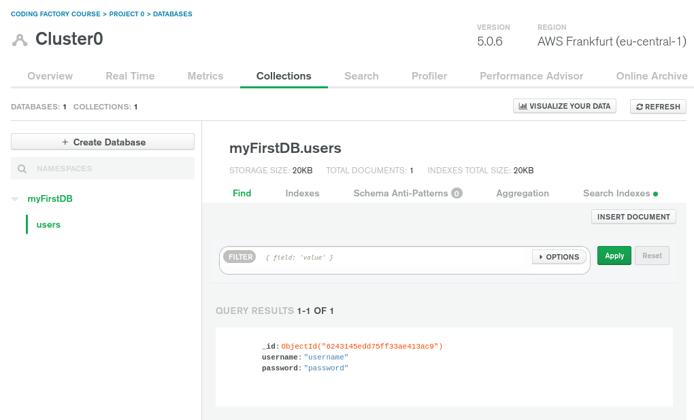

MongoEngine is an Object-Document Mapper, written in Python for working with MongoDB. To install it, simply run

```bash
python -m pip install -U mongoengine dnspython
```

Lets connect to an Atlas database and save a sample User document:

```python
from mongoengine import *

connect(
    db="myFirstDB",
    username="username",
    password="password",
    host="mongodb+srv://whatever.mongodb.net/db",
    alias="mydb",
)

class User(Document):
    username = StringField()
    password = StringField()

    meta = {"db_alias": "mydb", "collection": "users"}

User(username="username", password="password").save()
```

The above code saves a new document into the _user_ collection of the _myFirstDB_ database:


